# 💍 Wedding Invitation Platform - Esteban & Dany

Aplicación web full-stack serverless para gestionar invitaciones de boda con sistema de confirmaciones personalizado y mesa de regalos. Construida con Next.js 14, Supabase, Builder.io y deployada en Vercel.

## ✨ Características

- **Landing Page Editable**: Interfaz visual drag-and-drop con Builder.io para que usuarios no técnicos puedan editar contenido
- **Sistema de Confirmación con Tokens**: URLs únicas por invitado sin necesidad de login
- **Mesa de Regalos**: Catálogo interactivo con sistema de apartado en tiempo real
- **Dashboard Admin**: Métricas en vivo de confirmaciones y regalos
- **100% Gratuito**: Usa free tiers de Builder.io, Vercel y Supabase

## 🛠 Tech Stack

- **Frontend**: Next.js 14 (App Router), React 18, TypeScript
- **Styling**: Tailwind CSS 3+ con fuentes custom (Inter + Playfair Display)
- **Backend**: Supabase (PostgreSQL + Row Level Security)
- **CMS**: Builder.io para visual editing
- **Hosting**: Vercel con deploy automático
- **State Management**: React hooks (useState, useTransition)

## 📁 Arquitectura del Proyecto

```
wedding-esteban-dany/
├── app/
│   ├── layout.tsx              # Layout principal con fuentes
│   ├── globals.css             # Estilos globales de Tailwind
│   ├── builder-registry.tsx    # Registro de componentes Builder.io
│   ├── page.tsx                # Landing page (Builder.io)
│   ├── confirm/[token]/        # Sistema de confirmación
│   ├── gifts/                  # Mesa de regalos
│   └── admin/                  # Dashboard administrativo
├── components/
│   ├── builder/                # Componentes custom de Builder.io
│   │   ├── WeddingCountdown.tsx
│   │   ├── GalleryGrid.tsx
│   │   ├── ConfirmationCTA.tsx
│   │   └── RenderBuilderContent.tsx
│   ├── confirmation/           # Componentes de confirmación
│   │   ├── GuestConfirmation.tsx
│   │   └── PassCard.tsx
│   ├── gifts/                  # Componentes de regalos
│   │   ├── GiftRegistry.tsx
│   │   └── GiftCard.tsx
│   └── admin/                  # Componentes de admin
│       └── AdminDashboard.tsx
├── lib/
│   ├── database.types.ts       # Tipos generados de Supabase
│   └── supabase/
│       ├── server.ts           # Cliente Supabase para Server Components
│       └── browser.ts          # Cliente Supabase para Client Components
├── scripts/
│   └── generate-invites.ts     # Script CLI para generar invitaciones
├── supabase/
│   └── schema.sql              # Schema completo con RLS policies
└── package.json

```

## 🚀 Comandos

### Desarrollo

```bash
# Instalar dependencias
npm install

# Iniciar servidor de desarrollo
npm run dev

# Build para producción
npm run build

# Iniciar servidor de producción
npm start
```

### Scripts Adicionales

```bash
# Generar tipos TypeScript desde Supabase
npm run generate-types

# Generar invitaciones (batch insert)
npx tsx scripts/generate-invites.ts
```

## 📊 Diagrama de Arquitectura

```mermaid
graph TB
    A[Usuario] -->|Accede| B[Vercel CDN]
    B --> C[Next.js App Router]
    C --> D[Builder.io SDK]
    C --> E[Supabase Client]
    D -->|Fetch Content| F[Builder.io API]
    E -->|Queries/Mutations| G[Supabase PostgreSQL]
    G -->|RLS Policies| H[Row Level Security]
    C -->|ISR Revalidate| I[Static Generation]
    
    style C fill:#0070f3
    style G fill:#3ecf8e
    style F fill:#000000
```



## 🔐 Seguridad

- **Row Level Security**: Políticas RLS en Supabase restringen acceso por token
- **Token-based Auth**: Tokens UUID generados con `gen_random_bytes(16)`
- **No Public Search**: Sin búsqueda pública de invitados
- **Parameterized Queries**: Prevención de SQL injection via Supabase client

## 📈 Performance

- **TTFB**: < 200ms (Builder.io CDN + Vercel Edge)
- **LCP**: < 2.5s (Next.js Image optimization)
- **ISR**: Landing revalida cada 60s, Admin cada 10s
- **Lighthouse Score**: > 90

## 🌐 Rutas

| Ruta | Descripción | Tipo |
|------|-------------|------|
| `/` | Landing page editable | SSG + ISR (60s) |
| `/confirm/[token]` | Confirmación de invitado | SSR |
| `/gifts` | Mesa de regalos | SSR + ISR (10s) |
| `/admin` | Dashboard administrativo | SSR + ISR (10s) |

## 📝 Variables de Entorno

Ver [ENV_VARS.md](docs/ENV_VARS.md) para documentación completa.

```env
NEXT_PUBLIC_SUPABASE_URL=your_supabase_url
NEXT_PUBLIC_SUPABASE_ANON_KEY=your_anon_key
SUPABASE_SERVICE_ROLE_KEY=your_service_role_key
NEXT_PUBLIC_BUILDER_API_KEY=your_builder_api_key
```

## 📖 Documentación Adicional

- [SETUP.md](docs/SETUP.md) - Guía de configuración paso a paso
- [ENV_VARS.md](docs/ENV_VARS.md) - Documentación de variables de entorno
- [TROUBLESHOOTING.md](docs/TROUBLESHOOTING.md) - Solución de problemas comunes

## 👰🤵 Para la Novia: Editar Landing Page

1. Accede a [builder.io/content](https://builder.io/content)
2. Selecciona la página "/"
3. Usa el editor visual para:
   - Arrastrar componentes
   - Subir imágenes
   - Editar textos
   - Cambiar colores
4. Click en "Publish"
5. Los cambios se reflejan en < 60 segundos

## 📊 Monitoreo

- **Vercel Analytics**: Métricas de performance y errores
- **Supabase Dashboard**: Monitoreo de queries y uso de DB
- **Builder.io Analytics**: Tracking de visitas y ediciones

## 🎯 Limitaciones Free Tier

| Servicio | Límite | Uso Estimado |
|----------|--------|--------------|
| Builder.io | 25K requests/mes | ~2.5K requests |
| Supabase | 500MB DB + 2GB bandwidth | ~1.5MB DB, ~35MB bandwidth |
| Vercel | 100GB bandwidth | ~200MB bandwidth |

## 🤝 Contribución

Este es un proyecto personal para una boda. No se aceptan contribuciones externas.

## 📄 Licencia

MIT License - Uso libre para proyectos personales

---

**Hecho con ❤️ para Esteban & Dany**
